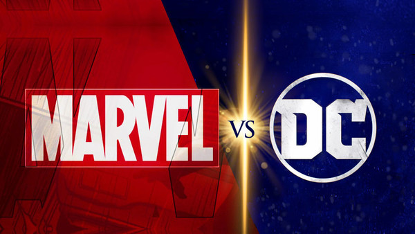
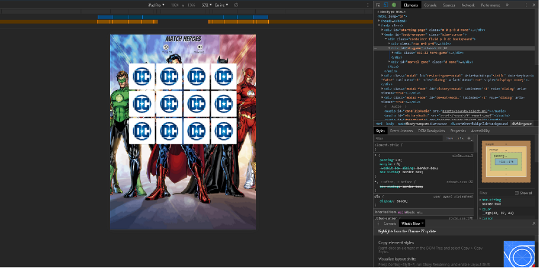

<h1 align="center">
  <a href="https://github.com/sWrAAb/milestone_project_2"></a>
</h1>
<br>
<div align="center"><h2>
<a href="https://swraab.github.io/milestone_project_2/">Play Hero Flippof here</a><h2>
<br>
<h2 align="center">
<a href="https://github.com/sWrAAb/milestone_project_2"></a>
</div>
<br>

## Table of Contents
1. [**UX**](#ux)
    - [**Project Goals**](#project_goals)  
    - [**Functionality of Project**](#functionality)
    - [**User Stories**](#user-stories)
    - [**Design choices**](#design-choices)
        - [**1. Fonts**](#1-fonts)
        - [**2. Logo**](#2-logo)
        - [**3. Wireframes**](#3-wireframes)
    
2. [**Features**](#features)
    - [**Existing Features**](#existing-features)
    - [**Features Left to Implement**](#features-left-to-implement)

3. [**Technologies used**](#technologies-used)

4. [**Testing**](#testing)

5. [**Deployment**](#deployment)
    - [**How to run this project locally**](#how-to-run-this-project-locally)

6. [**Credits**](#credits)
    - [**Media**](#media)
    - [**Code**](#code)
    - [**Acknowledgements**](#acknowledgements)

7. [**Disclaimer**](#disclaimer)

## UX

### Project Goals

This Milestone project uses skills learned from fourth and fifth modules of the Full
Stack Developer Course, Javascript Fundamentals & Interactive Frontend Development, to build a custom mobile-first fully
responsive javascript matching game called <a href="https://swraab.github.io/milestone_project_2/">**Hero Flipoff**</a>. 
The goal of the Hero Flipoff is to provide entertaining game. 

### Functionality of Project

This project is built using HTML5, CSS3 and Javascript to make the individual features of the game to work.
Bootstrap 4 Framework was used to provide responsive grid. jQuery was used for easier DOM, CSS and event manipulation.

### User Stories

As a player,I want:

1. Clean and aesthetically pleasing visuals.
2. Easy understanding of the game.
3. Easy controls.
4. Popular themes.
5. Option to choose different themes.
6. Audio and/or visual feedback when I play the game.
7. Positive audio feedback when I complete a step in the game.
8. Responsive game I can play on my phone or tablet.
9. A child-friendly game.

As Developer:
1. I want to create a pure Javascript game to test my skills.
2. I want to create fully responsive app to showcase my skills to a potential employer.
3. I want an on-going project I can enhance and improve over time as my skills grow.
4. I want to learn how to create games. 

### Design Choices

#### 1. Fonts

Main font is <a href="https://fonts.google.com/specimen/Bangers">**Bangers**</a> which was imported via the head element of the html file from Google Fonts, with the backup font being set to a default of "Sans-serif". This font was used for purpose of giving a comic book apperance.<br>
Secondary font used is <a href="https://fonts.google.com/specimen/Ubuntu">**Ubuntu**</a>.

#### 2. Logo

Game logo and favicon was designed on: <a href="https://hatchful.shopify.com">**Hatchful**</a>.

#### 3. Wireframes

These wireframes were created using <a href="https://balsamiq.com/">**Balsamiq**</a> during the Scope Plane part of the design and planning process for this project.

- <a href="https://ibb.co/T4NWdHc">Wireframes for mobile</a>

- <a href="https://ibb.co/vX2Yyyj">Wireframes for desktop</a>

[Back to Top](#table-of-contents) 

## Features

### Existing Features

1. **Universe Select Modal**
 - Modal is shown when on arriving at the page .
 - Universe select modal has been programed not to give any other option other then selecting **DC** or **Marvel** Universe.
 - Selecting an image, cards are shuffled, moves counter is set to zero and timer is restarted.
 - This modal is also activated if the **Restart Game Button**, **Victory Modal** or **Defeat modal** has been clicked.

2. **Victory Modal**
 - Modal is shown when all cards are matched.
 - On click, page is redirected to **Universe Select Modal**.

3. **Defeat Modal**
 - Modal is shown when timer reaches zero.
 - On click, page is redirected to **Universe Select Modal**.

4. **Reset Button**
 - Reloads starting page containing the **Universe Select Modal**.

5. **Mute Audio Button**
 -  The mute audio button switches off/on all audio in the game, also switches its icons.

6. **Moves Counter** 
 - Counts the number of turns the player has taken in the current game, which is later displayed on the **Victory Modal**.

### Features Left to Implement

- Add more cards.
- Add second player.
- Add background music.
- Add High Score Feature to store the best scores to local storage.
- When the game is finished, next level starts with less time.

### Removed Features 

 At the beginning of the development I wanted to add an animation when cards first appear, using velocity library. For some (still unknown) reason animation was overriding my css flip card animation so I removed it.

[Back to Top](#table-of-contents) 

## Technologies Used

- This project uses HTML, CSS and JavaScript programming languages.
- <a href="https://code.visualstudio.com">Visual Studio Code</a>
    - Developer used **Visual Studio Code** for their IDE while building the website.
- <a href="https://www.bootstrapcdn.com/">Bootstrap</a>
    - The project uses **Bootstrap** to simplify the structure of the website and make the website responsive.
    - The project also uses Bootstrap to provide icons from [FontAwesome](https://www.bootstrapcdn.com/fontawesome/)
- <a href="https://jquery.com"></a>
    - The project uses **JQuery** to simplify DOM manipulation.
- <a href="https://fonts.google.com/">Google Fonts</a>
    - The project uses **Google fonts** to style the website fonts.
- <a href="https://github.com/">GitHub</a>
    - This project uses **GitHub** to store and share all project code remotely.    
- <a href="https://autoprefixer.github.io/">AutoPrefixer</a>
    - The project used **AutoPrefixer** to make sure all css prefixes were the most up to date versions. 

[Back to Top](#table-of-contents) 

## Testing 

Continuous testing for this application was carried throughout the entire development. This was achieved through the Google Chrome devtools. Game was tested on mobile phones and laptops. Every element was tested on Google Chrome, Firefox, Opera & Internet Explorer. Javascript code was tested one function at a time using console log so I can see log or any error in devtools.

<h1 align="center">
  <a href="https://github.com/sWrAAb/milestone_project_2"></a>
</h1>

- Tried to break game by reloading several times and savagely clicking on all clickable parts of game. 

### Modals

- Modals were tested on every screen and orientation. Added 'data-backdrop="static"' to not allow a user to click outside of the modal and close same, and `data-keyboard="false" to remove pressing ESC button to close the modals. All modal images were tested to fit all screen sizes that led to different sizes of images on Universe Select modal for each screen.
- Victory and Defeat modals were tested to see if they redirect on Universe select modal on click.

### Timer
- Timer was tested to see if it is visible on screen. At first, even after victory, the timer was still running. When it reached zero Defeat Modal was shown so I added a line in the timer function to stop the timer when number of matches reaches 6.
That solved that bug, and victory screen is no longer interrupted.

### Cards 

- Cards were tested if they can be clicked more then once and if sound plays only on first click.
- Bug was found in early stages of game development. Back side of card was never shown, instead card showed mirrored front side. That bug was solved by reverting game version and rewrite most of the code.
- Display of cards was also tested on multiple devices and browsers to fit nicely without overflow (except on landscape orientation).
- With the help Media Query I change size of cards so they use most of the screen and tested it on all available devices and aforementioned browsers for any visual distortion or functionality problems.


- Fonts are made responsive, so they are different size on every screen size.


## Deployment

This project was developed using the <a href="https://code.visualstudio.com">Visual Studio Code</a>, committed to git and pushed to GitHub using the built in function within VSCode. 

To deploy Hero Flipoff to GitHub Pages from its <a href="https://github.com/sWrAAb/milestone_project_2">GitHub repository</a>, the following steps were taken: 
1. Log into GitHub. 
2. From the list of repositories on the screen, select **sWrAAb/milestone_project_2**.
3. From the menu items near the top of the page, select **Settings**.
4. Scroll down to the **GitHub Pages** section.
5. Under **Source** click the drop-down menu labelled **None** and select **Master Branch**
6. On selecting Master Branch the page is automatically refreshed, Hero Flipoff is now deployed. 
7. Scroll back down to the **GitHub Pages** section to retrieve the link to the deployed website.
 

### How to run this project locally

To clone this project from GitHub:
1. Follow this link to the <a href="https://github.com/sWrAAb/milestone_project_2">Hero Flipoff GitHub repository</a>.
2. Under the repository name, click "Clone or download".
3. In the Clone with HTTPs section, copy the clone URL for the repository. 
4. In your local IDE open Git Bash.
5. Change the current working directory to the location where you want the cloned directory to be made.
6. Type ```git clone```, and then paste the URL you copied in Step 3.
```console
git clone https://github.com/USERNAME/REPOSITORY
```
7. Press Enter. Your local clone will be created.

[Back to Top](#table-of-contents)   

## Credits

 ### Media

  #### Images

- Card images were downloaded from http://www.fanpop.com, http://www.vhv.rs, https://www.writeups.org, http://hiclipart.com,
http://pngguru.com.<br>
- Background images were downloaded from: https://wallpaperaccess.com/dc-comics, http://sfwallpaper.com/categories/marvel-wallpaper.html and https://aminoapps.com/c/comics/page/blog/batman-vs-wolverine/Jvid_urkYKPPRvqBWw7m4nQZavn8er.<br>
- Modal images were downloaded from: https://www.business2community.com/business-intelligence/nevermind-new-avengers-infinity-war-movie-heres-become-hero-using-modern-business-intelligence-02043336 and https://www.businessinsider.com/nuclear-bomb-effects-video-red-cross-2019-10?r=US&IR=T

#### Sounds

All sounds were downloaded from: https://freesound.org.

### Code


styles from: https://css-tricks.com

 
blinking text animation from: https://html-online.com/articles/blinking-text-css-animation/
 

###### <i>Disclaimer: This project was created for educational use only as part of the Code Institute Full Stack Software Development Course for Milestone 2 Grading!</i>

[Back to Top](#table-of-contents)
